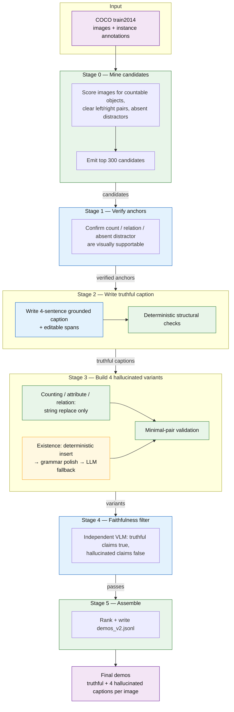
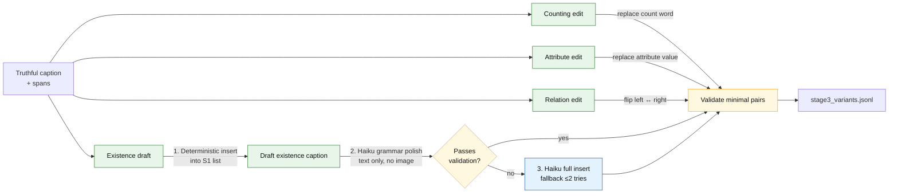
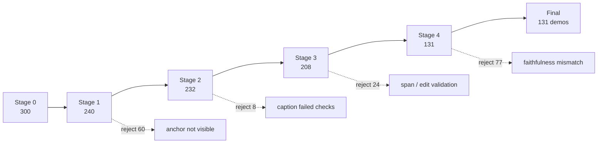
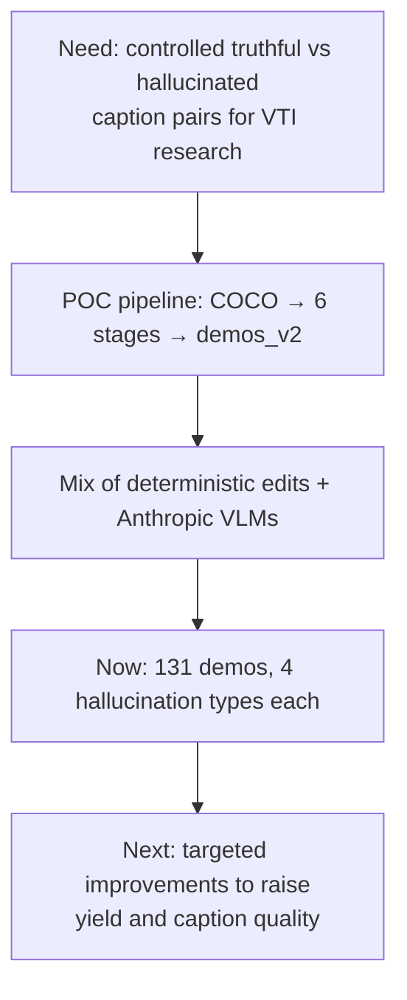

# VTI Demo Caption Generation Pipeline (`demos_v2`) — Overview

**Audience:** managers / stakeholders  
**Status:** working proof-of-concept (POC)  
**Date:** 2026-07-13  
**Output today:** 131 finalized image–caption demos from a 300-candidate COCO pool  

## Why this exists

Vision-language models (VLMs) sometimes **hallucinate** — they invent objects, wrong attributes, wrong counts, or wrong spatial relations. Our steering method (VTI) needs paired captions:

- a **truthful** caption grounded in the image  
- a **hallucinated** caption that differs in a controlled way  

Author-released demos exist, but their hallucinations are opaque (mixed object injection). **`demos_v2` builds controlled minimal pairs** so each demo has four labeled hallucination types we can study separately:

| Dimension | What goes wrong in the hallucinated caption |
|-----------|-----------------------------------------------|
| **Existence** | Mentions an object that is **not** in the image |
| **Attribute** | Wrong visual property (e.g. color) |
| **Counting** | Inflated object count |
| **Relation** | Flipped left/right spatial claim |

---

## End-to-end pipeline (current implementation)

**Legend**

| Color / style | Meaning |
|---------------|---------|
| Green | **Deterministic** (code / rules / string edits — no model call) |
| Blue | **Model-driven** (vision or text MLLM API call) |
| Amber | **Hybrid** (deterministic draft + small model repair, with model fallback) |

---

## Stage cheat sheet

| Stage | What happens | Deterministic vs model | Default model |
|-------|----------------|------------------------|---------------|
| **0** Mine | From COCO annotations: pick images with a countable category (2–9), a clear left/right pair, and absent co-occurring distractor candidates; rank and keep top **300** | **Deterministic** (CPU) | — |
| **1** Verify | Look at the image; confirm count & spatial relation are visible; choose a distractor that is truly absent | **Vision model** | Claude **Sonnet 4.6** |
| **2** Caption | Write a **4-sentence** truthful caption tied to those anchors; record exact edit spans | **Vision model** + **deterministic** validators | Claude **Opus 4.8** |
| **3** Variants | Build four hallucinated captions from the truthful one | See below | Claude **Haiku 4.5** (text-only, existence path) |
| **4** Filter | Independent check: truthful sentences should be true; each hallucinated claim should be false | **Vision model** (must differ from stage-2/3 models) | Claude **Sonnet 4.6** |
| **5** Assemble | Sort by stage-0 rank; write final JSONL | **Deterministic** | — |

### Stage 3 detail (where cost vs control matters)

In the full-300 POC run, existence succeeded as **deterministic + grammar polish** for **199 / 208** stage-3 passes; only **9** needed the full LLM insert fallback.

---

## Caption structure (every demo)

Each truthful caption has a fixed four-sentence template so edits stay local:

| Sentence | Role | Hallucination edit |
|----------|------|--------------------|
| S1 | Scene + object list | Insert absent object (**existence**) |
| S2 | One attribute claim | Change the attribute value (**attribute**) |
| S3 | “There are at least *N* …” | Inflate *N* (**counting**) |
| S4 | “*A* is to the left/right of *B*” | Flip direction (**relation**) |

**Example (existence only):**  
Truthful S1 lists real objects → hallucinated S1 also lists a **chair** that is not in the image; sentences 2–4 stay identical.

---

## POC yield (full 300-candidate run)

| Stage | Pass | Reject | Main loss mode |
|-------|------|--------|----------------|
| 0 → 1 | 240 | 60 | Count / relation / distractor not visually clear |
| 1 → 2 | 232 | 8 | Caption failed structural rules |
| 2 → 3 | 208 | 24 | Deterministic edit validation failed |
| 3 → 4 | **131** | **77** | Independent VLM disagreed on true/false claims |
| Final | **131** | — | All stage-4 passes kept |

Largest drop today: **stage 4** (faithfulness filter). That is expected for a conservative POC filter and is a primary place for quality/yield improvements.

---

## What managers should take away

1. **We can generate labeled hallucination pairs** (existence / attribute / counting / relation) instead of opaque author demos.  
2. **Most of the pipeline is controlled:** mining and three of four hallucination edits are deterministic; models are used where vision or light grammar repair is needed.  
3. **Defaults are intentional:** stronger vision models for caption writing (Opus) and verification (Sonnet); cheap text model (Haiku) only for existence grammar / rare fallback.  
4. **POC scale:** 131 usable demos from 300 candidates — enough to prototype experiments; not yet a final production corpus size.  
5. **Improvements are next** (section below) — aimed at higher yield and cleaner captions without losing edit locality.

---

## Planned improvements (to improve output)

> *Fill in with agreed changes as they are decided. Below are placeholders aligned with where the POC loses the most quality/yield today.*

| Priority | Improvement area | Intent | Status |
|----------|------------------|--------|--------|
| 1 | *(TBD — Romanus)* | | Pending detail |
| 2 | *(TBD)* | | Pending detail |
| 3 | *(TBD)* | | Pending detail |

**Observed POC pressure points** (for discussion — not yet committed designs):

- **Stage 4 rejects (~37% of stage-3 passes):** faithfulness filter is strict and model-based; may reject good demos or keep borderline ones.  
- **Stage 1 rejects (20%):** annotation-based anchors that are hard to see in the photo.  
- **Stage 3 non-existence failures:** span bookkeeping when the truthful caption’s wording drifts from expected tokens.  
- **Corpus size:** 131 &lt; research target often discussed (~150+); top-up mining + higher pass rate both help.

When improvement specs arrive, update this table and (if helpful) add a second Mermaid diagram: **Current → Improved** for the affected stage(s).

---

## Artifacts & review

| Artifact | Location |
|----------|----------|
| Final demos | `data/vti/demos_v2.jsonl` |
| Per-stage pass/reject + summaries | `data/vti/v2/` |
| HTML review galleries | `python data_scripts/vti_demos_v2/render_review.py --stage final` |
| Flat export for VTI loaders | `export_vti_flat.py --dimension {existence\|attribute\|counting\|relation}` |

---

## One-slide summary

